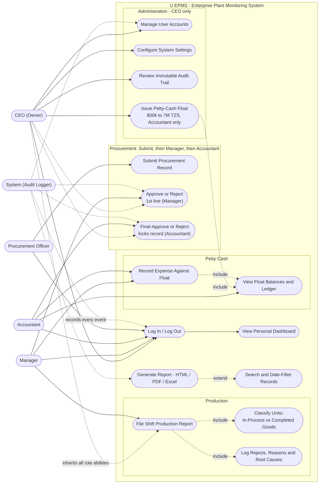
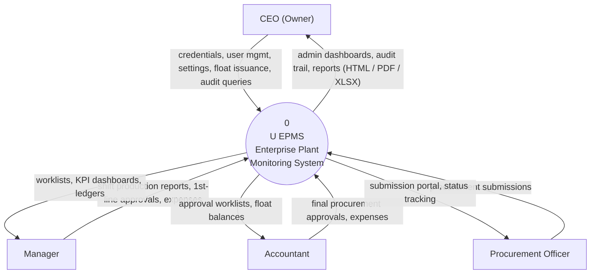
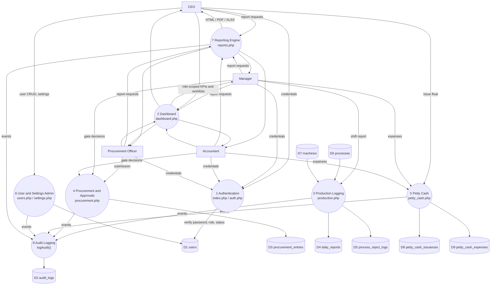
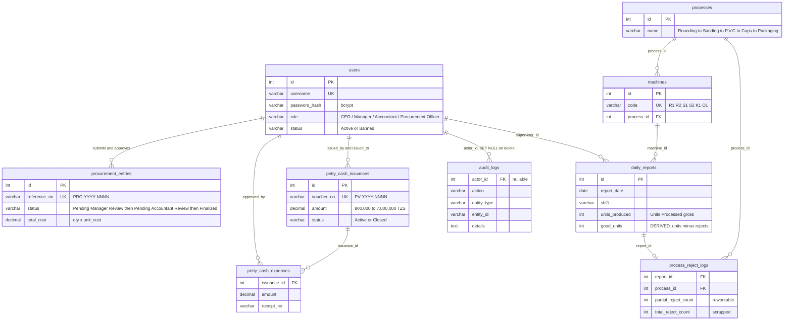

<div align="center">

# U EPMS — Enterprise Plant Monitoring System

**Role-based ERP for a broom-stick factory** — procurement, production, petty cash & audit under one roof.

Pure PHP 8.x • Plain HTML5/CSS3 (zero frameworks) • MySQL (localhost) or SQLite fallback • Currency: **TZS**

**[📖 Use Cases](docs/01-use-case-diagram.md) · [🔀 Data Flow Diagrams](docs/02-data-flow-diagrams.md) · [🗄️ ERD](docs/03-entity-relationship-diagram.md) · [📋 Table Reference](docs/04-table-reference.md)** — all diagrams below render inline.

</div>

---

## 📐 System Diagrams

### Use Case Diagram

Four human roles plus an automated audit system. The **CEO (Owner)** inherits every role's
capabilities as override authority; the **Procurement Officer submits but never approves**.



### Data Flow Diagrams

**Level 0 (Context)** — the system boundary:



**Level 1** — major subsystems mapped to real pages and tables (D# = MySQL table in `factory_db`):



### Entity-Relationship Diagram

13 foreign keys across 9 tables — the `users` table is the hub every "who did this" points at.



> Full-size diagrams, step-numbered Level-2 DFDs (procurement gates, petty cash, production,
> reporting), and complete use-case specifications live in the
> [`docs/`](docs/) folder.

---

## 🔁 Core Business Flows

**Procurement (two-gate, immutable once finalized):**

```
Procurement Officer            Manager                      Accountant
      │                          │                              │
      │ submit (PRC-2026-XXXX)   │                              │
      ├─────────────────────────▶│  appears on dashboard        │
      │                          │ approve / reject             │
      │                          ├─────────────────────────────▶│ appears on dashboard
      │                          │                              │ FINAL approval (locks)
      │                          │                              ├─▶ Finalized 🔒
```
- The Officer has **no approve action at all** (server-enforced).
- The Accountant **cannot skip the Manager's gate** (status-checked server-side).
- Finalized/Rejected records are immutable.

**Production (6-stage broom-stick pipeline):**
Rounding (R1, R2) → Sanding (S1, S2) → P.V.C K Line (K1) → P.V.C O Line (O1) → **Cups** (by hand —
finished broom sticks are counted here) → Packaging/Sewing (machine or hand, bundled).
Units are logged as **Units Processed** per shift/machine; units at Cups are auto-classified
**Completed Goods**, earlier stages **In-Process**. Accepted units are **derived**
(units − reworkable − scrapped) — there is no manual QA field.

**Petty cash:** the CEO issues floats of **TZS 800,000 – 7,000,000**; the **Accountant is the sole
permitted float holder** (server-validated). Expenses are receipted against the float; the
remaining balance is always computed live (`amount − Σ expenses`).

**Reporting:** every role gets role-scoped report templates (Production, Procurement, Petty-Cash
Floats, Petty-Cash Expenses, Audit Trail — CEO only) with HTML preview and downloads:
- **PDF** — pure-PHP engine (no libraries): fully wrapped table cells (no truncation), row
  separators, zebra striping, totals row, page footers.
- **Excel (.xlsx)** — pure-PHP engine: merged title banner, content-sized columns, frozen header,
  auto-filter, banded rows, typed numeric/date cells, styled totals.

## 👥 Role & Permission Model

| Capability | Procurement Officer | Manager | Accountant | CEO |
|---|---|---|---|---|
| **Submit procurement records** | ✅ (only authority) | — | — | — |
| First procurement approval | — | ✅ (dashboard) | — | — |
| **Final procurement approval** | — | — | ✅ (dashboard, locks record) | — |
| View procurement records | ✅ | ✅ | ✅ | ✅ |
| Log production shift reports | — | ✅ | view-only | ✅ |
| **Record petty cash expenses** | — | ✅ | ✅ | — |
| **Issue new petty cash floats** | — | — | ❌ (holder, not issuer) | ✅ (only authority) |
| Machinery & process config | — | — | — | ✅ |
| **Audit trail** | ❌ | ❌ | ❌ | ✅ |
| Ban / delete users, password vault | — | — | — | ✅ |
| Reports | procurement only | role-scoped | role-scoped | all |

Deleting a user removes the account completely while preserving historical business records
(procurement entries, floats, expenses, reports) — their user references become NULL via
`ON DELETE SET NULL` foreign keys, and the audit trail stays intact.

## 🚀 Run Locally (XAMPP / localhost)

**Prerequisites:** PHP 8.x with `pdo_mysql` (XAMPP includes it), MySQL/MariaDB running.

1. Start **Apache/MySQL** in the XAMPP control panel (MySQL is required for the default config).
2. Configure the environment in `.env` (already set up for localhost XAMPP):

   ```env
   DB_DRIVER=mysql
   DB_HOST=127.0.0.1
   DB_PORT=3306
   DB_NAME=factory_db
   DB_USER=root
   DB_PASS=
   ```

3. Create the database + seed data — either:
   - open **phpMyAdmin** → Import → choose `database.sql`, **or**
   - run `mysql -u root < database.sql`, **or**
   - just start the app: it auto-creates the schema and seeds demo data on first run.

4. Open the app — no terminal needed:
   - **XAMPP Apache (recommended):** start Apache in the XAMPP Control Panel, then browse to
     <http://localhost:3000>. (The folder ships with `apache-conf/httpd-uepms.conf` — if you ever
     reinstall XAMPP, copy it to `C:\xampp\apache\conf\extra\` and add
     `Include "conf/extra/httpd-uepms.conf"` to `httpd.conf`.)
   - **Built-in server alternative:** `php -S 127.0.0.1:3000 router.php` → <http://127.0.0.1:3000>

### SQLite fallback (zero configuration)

Set `DB_DRIVER=sqlite` in `.env` — the schema is created and seeded automatically at
`data/factory.db`. No MySQL needed.

## 🔑 Demo Accounts

Password for every seeded account: `factory123`

| User | Username | Role |
|---|---|---|
| BRIGHTON MMARI | `brighton_mmari` | CEO (Owner) |
| GLORY GEORGE | `glory_george` | Manager |
| SWAUMU MKOMWA | `swaumu_mkomwa` | Accountant |
| GLORIA MGASSA | `gloria_mgassa` | Procurement Officer |
| Victor Diaz | `victor_diaz` | Procurement Officer (**Banned** — login rejected) |

## 🔐 Password Vault (CEO)

On the **Users** page, the CEO can:

- **View Password** — reveals the account's current password (from the encrypted vault).
  Every reveal is written to the Audit Trail as `PASSWORD_VIEWED`.
- **Change Password** — sets a new password (min 6 characters) for any account.
  Logged in the Audit Trail as `PASSWORD_CHANGED`.

How it works: login verification always uses the one-way **bcrypt** hash (`password_hash`).
A second, **AES-256-GCM encrypted** copy of the password is stored in the
`users.password_encrypted` column so it can be recovered by the CEO. The key lives
in `APP_KEY` (`.env`) — generate one with `php -r "echo bin2hex(random_bytes(32));"`.
Changing `APP_KEY` makes all stored vault passwords unreadable (logins still work).

> **Security note:** storing reversible passwords weakens the security model (anyone with
> DB + `APP_KEY` access can read every password). This is intentional for this internal
> deployment; remove `view_password`/`change_password` and the `password_encrypted` column
> to revert to hash-only storage.

## 💱 Currency

All monetary amounts are stored and displayed in **Tanzanian Shillings (TZS)** — see
`formatMoney()` in `includes/functions.php` and the `APP_CURRENCY` constant in `config.php`.

## 🗄️ Database Schema

`database.sql` contains the complete MySQL schema (utf8mb4, InnoDB, foreign keys) plus seed data:

| Table | Purpose |
|---|---|
| `users` | RBAC directory (role, status: Active/Banned) |
| `processes`, `machines` | 6-stage pipeline + machine registry (R1…O1) |
| `procurement_entries` | records + two-gate approval columns (submit → manager → accountant) |
| `daily_reports`, `process_reject_logs` | shift production & defect breakdowns |
| `petty_cash_issuances`, `petty_cash_expenses` | float vouchers (TZS 800k–7M) & receipted expenses |
| `audit_logs` | immutable audit trail (CEO visibility) |

Column-by-column reference: [`docs/04-table-reference.md`](docs/04-table-reference.md).

## ✅ Tests

An end-to-end RBAC suite boots the PHP server and verifies every role boundary over HTTP —
**41 assertions** including procurement gate order, petty-cash holder/amount rules, the
nav-label regression, and PDF/XLSX generation:

```bash
bash tests/e2e_rbac_test.sh            # 41 RBAC assertions (needs MySQL running)
```

## 📝 Notes

- Sessions use plain cookies on `http://localhost` and secure `SameSite=None` cookies on
  HTTPS automatically (see `includes/session.php`).
- An immutable audit record is written for every security-relevant action (logins, bans,
  deletions, approvals, float issuance, expenses, machine changes, report generation).
- The login page intentionally ships **no** 1-click demo logins or password hints.
