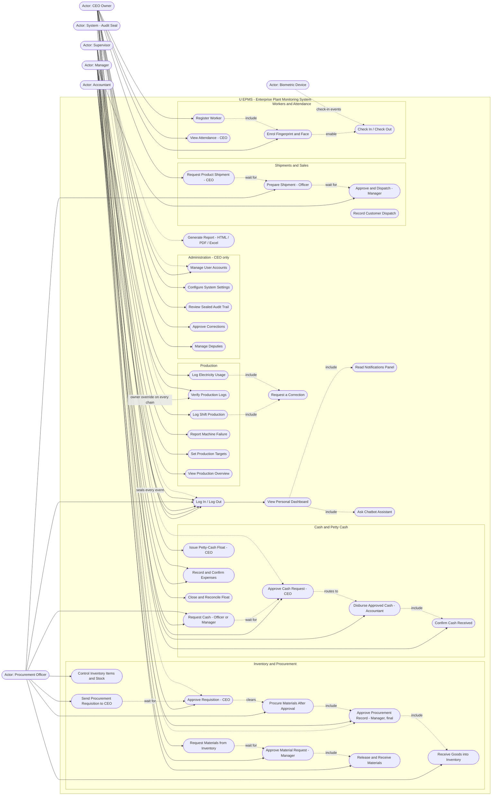

# 01 — Use Case Diagram

> U EPMS (Enterprise Plant Monitoring System) — broom-stick factory, version 2.3.
> Roles verified against the live code (`requireRole()` on every page) and the live database.
> Six roles: **CEO (Owner), Manager, Accountant, Procurement Officer, Supervisor**, plus the
> automated system (audit seal, notifications, chatbot, biometric device).

## 1. Actors

| Actor | Type | What they do | What they must NOT do |
|---|---|---|---|
| **CEO (Owner)** | Primary | Owner of the factory. Approves procurement requisitions, cash requests and corrections. Requests product shipments. Issues the petty-cash float. Manages users, settings and the audit trail. Views everything, including inventory (read-only) and worker attendance. | Modify inventory stock directly; log day-to-day production (logged entries still need the Manager's verification) |
| **Manager** | Primary | Verifies (approves the authenticity of) production logs from the Supervisor. Approves shipments prepared by the Officer. Approves material requests from inventory. Sets production targets. Requests cash and confirms receiving it. Countersigns petty-cash expenses. | Touch inventory stock, log production or electricity, approve procurement requisitions |
| **Accountant** | Primary | Sole custodian of the petty-cash float. Records expenses, closes floats. Disburses cash **only after** the CEO approved the request. Requests float top-ups from the CEO. | See or log production, approve procurement, touch inventory, prepare shipments |
| **Procurement Officer** | Primary | Full control of inventory (items, stock in/out, low-stock alerts). Sends procurement requisitions to the CEO, procures after approval, receives goods into inventory. Prepares shipments for the Manager to approve. Requests cash for payments. | Approve own requisitions (CEO does), approve shipments (Manager does), hold cash |
| **Supervisor** | Primary | Logs production per shift, logs electricity usage, reports machine failures with reasons. Requests materials from inventory and confirms receipt when they arrive. | Approve anything, see money, hold stock, procure |
| **System (Audit Seal)** | Secondary | Hash-chains every security-relevant event into the tamper-evident audit log; shows a live "chain verified" banner. | — |
| **Biometric Device** | Secondary | Pushes fingerprint/face check-in events for registered workers (`api_biometric.php`, key-authenticated). | — |

Actor generalization: the **CEO inherits every use case** as owner override, except money custody — the float is still *held* by the Accountant only, and cash is still *disbursed* by the Accountant only.

## 2. Use Case Diagram

### Mermaid source (renders on GitHub, GitLab, VS Code, mermaid.live)

## 3. Key Flows (exactly as enforced in the code)

### Procurement — requisition first, money last
1. **Officer sends requisition** (`UC31`) → status `Pending CEO Approval`. The Officer is blocked from procuring until it is approved.
2. **CEO approves** (`UC32`) → the Officer is cleared to procure (`UC33`).
3. The record flows to the **Manager, whose approval is final** (`UC34`) — it locks the record.
4. **Officer receives the goods into inventory** (`UC35`) — guarded so it can only happen once.
5. Payment is **not** a procurement step: the Officer requests cash (`UC40`), the CEO approves (`UC41`), it routes automatically to the Accountant who disburses (`UC42`) and the receiver confirms (`UC43`).

### Cash requests — the only road to money
Officer or Manager requests → **CEO approves (the only approver)** → request appears on the Accountant's desk automatically → Accountant disburses → receiver confirms. The Accountant never approves the *need*, only moves the *money*.

### Production — the Supervisor logs, the Manager verifies
Every production entry lands as `Pending Verification`. The Manager verifies authenticity (`UC21`); only then does it count in KPIs and reports. The Supervisor also logs electricity (`UC22`) and reports machine failures with reasons (`UC23`), which the Manager verifies the same way.

### Materials — request, approve, release, confirm
Supervisor requests (`UC36`); if the request exceeds stock the system fires a shortage alert immediately. Manager approves (`UC37`). Officer releases stock and the Supervisor confirms receipt (`UC38`) — stock is deducted on release.

### Corrections — mistakes fixed under supervision
Any user selects the mistaken record and explains (`UC5`). The CEO approves (`UC13`); the requester may then change **only the field(s) they selected** — enforced server-side with a field whitelist — and every step is audit-sealed.

### Petty cash — one holder, hard bounds
The CEO issues the float to **an active Accountant only** (`UC44`), amount **800,000 – 7,000,000 TZS**. Expenses are recorded by the Accountant and **two-signature confirmed** (`UC45`). Floats close out with reconciliation (`UC46`).

### Shipments — requested from the top
The **CEO requests** a shipment of finished products (`UC50`) → the Officer prepares bundles/units and destination (`UC51`) → the **Manager approves and it dispatches** (`UC52`), deducting finished stock. Separate from this, customer dispatches/sales are recorded (`UC53`).

### Chatbot — role-scoped answers
The CEO's chatbot answers overview questions (money, production, inventory, shipments, attendance). For every other role the chatbot is a **reminder assistant only** — pending approvals and unread notifications; it refuses to reveal anything outside the asker's role (verified by tests).

## 4. Role → Use Case Matrix

| Use case | CEO | Manager | Accountant | Proc. Officer | Supervisor |
|---|:-:|:-:|:-:|:-:|:-:|
| Log in, dashboard, notifications, chatbot | ✔ | ✔ | ✔ | ✔ | ✔ |
| Request a correction | ✔ | ✔ | ✔ | ✔ | ✔ |
| Log production / electricity / failures | ✔* | ✘ | ✘ | ✘ | ✔ |
| Verify production logs | ✔ | ✔ | ✘ | ✘ | ✘ |
| Set production targets | ✔ | ✔ | ✘ | ✘ | ✘ |
| Inventory: add items, stock in/out | view-only | ✘ | ✘ | ✔ | ✘ |
| Send procurement requisition | ✘ | ✘ | ✘ | ✔ | ✘ |
| Approve requisition (before procuring) | ✔ | ✘ | ✘ | ✘ | ✘ |
| Approve procurement record (final) | ✔ | ✔ | ✘ | ✘ | ✘ |
| Receive goods into inventory | ✘ | ✘ | ✘ | ✔ | ✘ |
| Request materials from inventory | ✘ | ✘ | ✘ | ✘ | ✔ |
| Approve material request | ✘ | ✔ | ✘ | ✘ | ✘ |
| Release / receive materials | ✘ | ✘ | ✘ | ✔ releases | ✔ receives |
| Request cash | ✘ | ✔ | ✘ | ✔ | ✘ |
| Approve cash request | ✔ | ✘ | ✘ | ✘ | ✘ |
| Disburse cash / hold float | ✘ | ✘ | ✔ | ✘ | ✘ |
| Confirm cash received | ✔ | ✔ | ✘ | ✔ | ✘ |
| Issue petty-cash float | ✔ | ✘ | ✘ | ✘ | ✘ |
| Record petty-cash expense | ✘ | ✘ | ✔ | ✘ | ✘ |
| Request shipment | ✔ | ✘ | ✘ | ✘ | ✘ |
| Prepare shipment | ✘ | ✘ | ✘ | ✔ | ✘ |
| Approve + dispatch shipment | ✘ | ✔ | ✘ | ✘ | ✘ |
| Register workers / enrol biometrics | ✔ | ✔ | ✘ | ✘ | ✘ |
| View attendance | ✔ | ✘ | ✘ | ✘ | ✘ |
| Users, settings, audit trail, corrections approval, deputies | ✔ | ✘ | ✘ | ✘ | ✘ |
| Reports (role-scoped) | ✔ all | ✔ prod + own finances | ✔ cash only | ✔ own + inventory | ✔ production |

\* CEO-entered production logs still await the Manager's verification — the Manager verifies, never logs.

Every ✔ is enforced twice: navigation (sidebar) and again per-action inside each page via `requireRole()` — hiding a link is never the security boundary.
