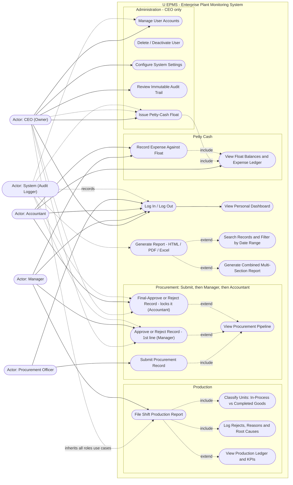

# 01 — Use Case Diagram

> U EPMS (Enterprise Plant Monitoring System) — Broom-stick factory.
> Roles verified against the live code (`requireRole()` in every page) and the live database.
> The System Operator role was removed from the system; the ADMIN account is now **CEO (Owner)**.

## 1. Actors

| Actor | Type | Description | Source of authority |
|---|---|---|---|
| **CEO (Owner)** | Primary | Owner & C.E.O of the factory. Full administrative access: user management, settings, audit trail, float issuance. Sits above every approval chain as an override. | `users.php`, `settings.php`, `audit_logs.php` = CEO-only |
| **Manager** | Primary | Runs production. Files shift production reports, performs the **first-line approval** of procurement records, records petty-cash expenses. | `production.php`, procurement `manager_*` actions |
| **Accountant** | Primary | Sole custodian of the petty-cash float. Performs the **final approval** of procurement records. View-only on production (read-only ledger). | petty-cash holder check, procurement `accountant_*` actions |
| **Procurement Officer** | Primary | Submits records of what has been procured. **Does not inspect, approve, or produce.** Sees only their own submissions + reports. | `procurement.php` (create-only), `reports.php` |
| **System (Audit Logger)** | Secondary system actor | Automatically records every security-relevant event (logins, approvals, report generation) into the immutable audit trail. | `logAudit()` in `includes/functions.php` |

Actor generalization: **CEO inherits every use case** of Manager, Accountant and Procurement Officer (override authority), in addition to the CEO-exclusive use cases.

## 2. Use Case Diagram

### Mermaid source (renders in GitHub / VS Code / mermaid.live)

## 3. Use Case Specifications (key flows)

### UC-30 — Submit Procurement Record *(Procurement Officer)*
- **Precondition:** Officer logged in.
- **Main flow:** Officer opens *Procurement Records → New Submission*; enters supplier, item, category, quantity, unit, unit cost → system computes `total_cost = quantity × unit_cost`, assigns reference `PRC-YYYY-NNNN`, stores status **Pending Manager Review** → confirmation flash.
- **Postcondition:** Record visible on Manager dashboard worklist. Officer **cannot** approve at any stage (server-enforced).

### UC-31 — Approve / Reject Record — 1st line *(Manager)*
- **Precondition:** Record status = *Pending Manager Review*.
- **Main flow:** Manager sees it under *Procurement Awaiting Your Approval* on the dashboard; approves (stores `manager_approved_by/at/notes` → status **Pending Accountant Review**) or rejects (status **Rejected** + reason).
- **Alternative:** CEO may perform this step directly (override).

### UC-32 — Final-Approve Record *(Accountant — final approver)*
- **Precondition:** Record status = *Pending Accountant Review*.
- **Main flow:** Accountant sees it under *Procurement Awaiting Your Final Approval*; final approval stores `accountant_approved_by/at/notes` → status **Finalized** → record becomes **immutable**.
- **Rule:** Stage-skipping is blocked server-side — the Accountant cannot approve before the Manager. Rejection at any stage ends the flow (status **Rejected**).

### UC-14 — Issue Petty-Cash Float *(CEO issues, Accountant holds)*
- **Main flow:** CEO enters holder (dropdown lists **active Accountants only**), amount and purpose. Server validates **800,000 ≤ amount ≤ 7,000,000 TZS** and holder role; generates unique voucher `PV-YYYY-NNNN`; stores float **Active**; audit-logged.
- **Postcondition:** Accountant (or Manager, delegated) may now record expenses against the float; remaining balance = `amount − Σ(expenses)`.

### UC-20 — File Shift Production Report *(Manager / CEO)*
- **Main flow:** Manager selects date, shift (Morning/Afternoon/Night), machine (R1, R2, S1, S2, K1, O1…), process (Rounding → Sanding → P.V.C K → P.V.C O → Cups → Packaging/Sewing), **Units Processed**, partial rejects (reworkable), scrapped rejects, defect reason, root cause, notes.
- **Included behaviour — UC-21:** units logged at **Cups** are automatically classified **Completed Goods** (finished broom sticks counted); units at any earlier stage are **In-Process**. This tag is live in the form and stored on the record.
- **Derived:** *Accepted units = Units Processed − Partial Rejects − Scrap* (calculated; no manual "Good Units Passed QA" field).
- **Validation:** rejects cannot exceed units processed; both halves (report + reject breakdown) are written in one DB transaction.

### UC-60 — Generate Report *(every role; role-scoped templates)*
- **Main flow:** user picks report template (Production Shift, Procurement Records, Petty-Cash Floats, Petty-Cash Expense Ledger, Audit Trail — CEO only), date range, format: **HTML preview / PDF / Excel**.
- **Extensions:** combined multi-section report; search & date filters feed both preview and downloads. Generation is audit-logged.

### UC-1 — Log In *(all actors)*
- Login by username + password (hashed; bcrypt via `password_hash`). Account **banned/disabled** state is enforced at login.

## 4. Role → Use Case Matrix

| Use case | CEO | Manager | Accountant | Procurement Officer |
|---|:-:|:-:|:-:|:-:|
| Log in / view dashboard | ✔ | ✔ | ✔ | ✔ |
| File shift production report | ✔ | ✔ | view-only | ✘ |
| Submit procurement record | ✔ | ✘ | ✘ | ✔ |
| Approve (1st line) procurement | ✔ | ✔ | ✘ | ✘ |
| Final-approve procurement (locks) | ✔ | ✘ | ✔ | ✘ |
| Issue petty-cash float | ✔ | ✘ | ✘ | ✘ |
| Record petty-cash expense | ✘ | ✔ | ✔ | ✘ |
| Manage users / settings / audit trail | ✔ | ✘ | ✘ | ✘ |
| Generate reports (role-scoped templates) | ✔ | ✔ | ✔ | ✔ |

Every ✔ in this matrix is enforced twice: in the navigation (sidebar links) and again in each page via `requireRole()` / per-action role checks — navigation hiding is never the security boundary.
