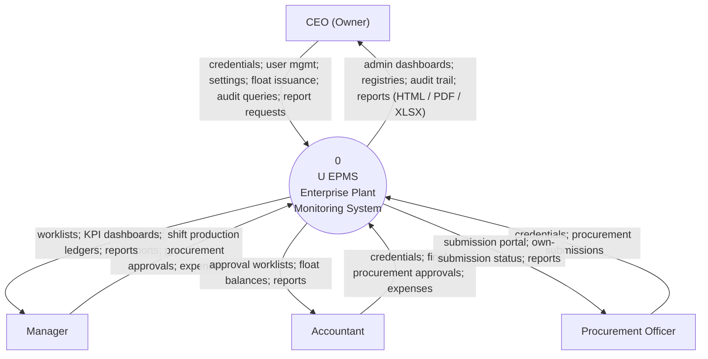
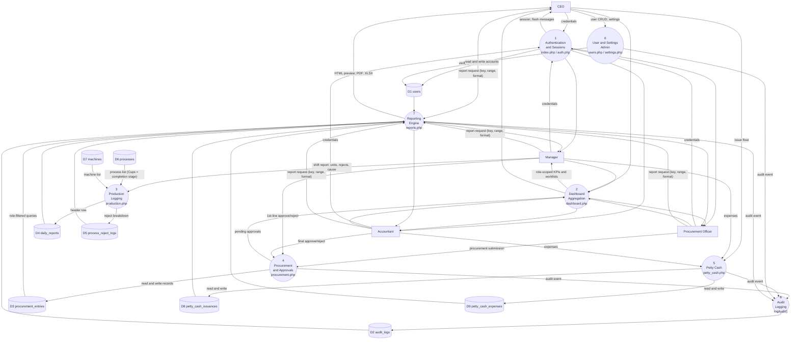
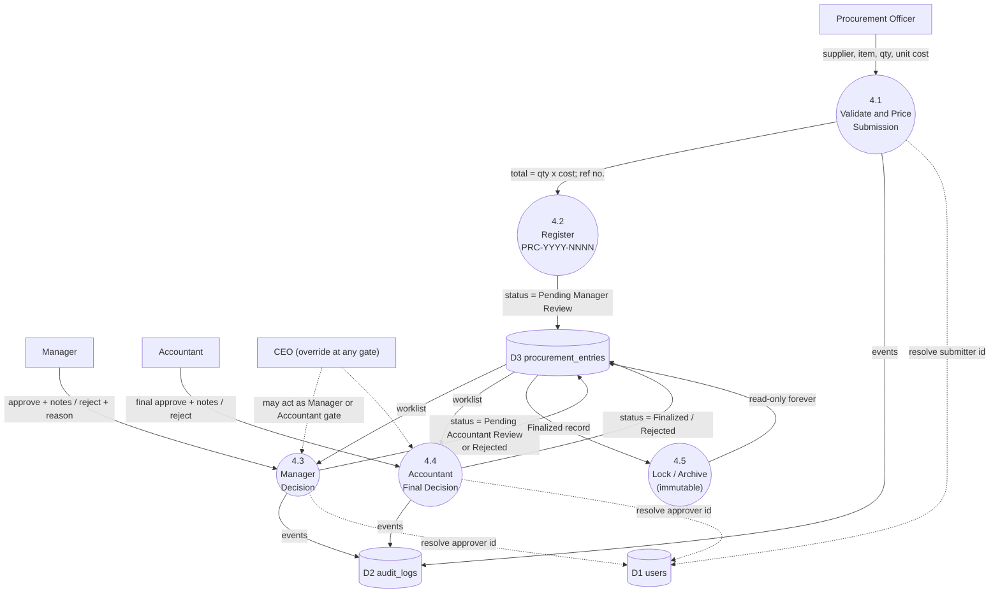
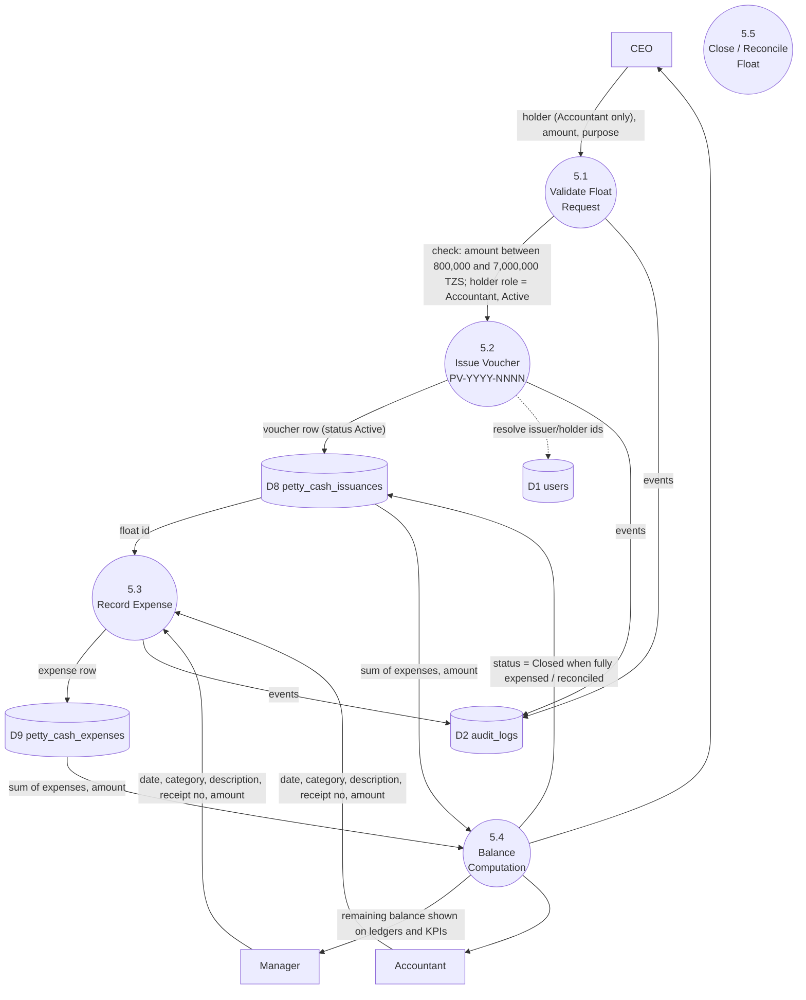
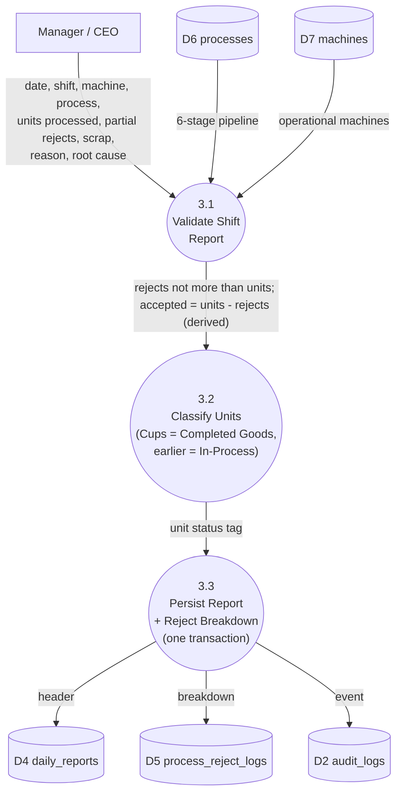
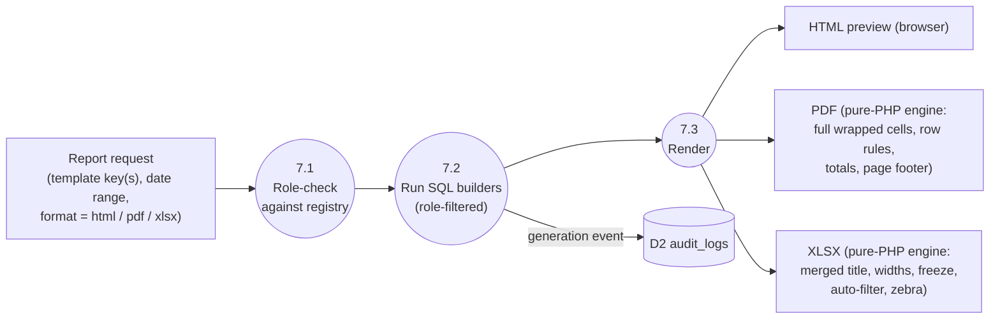

# 02 — Data Flow Diagrams (DFD)

> Levels: **Context (Level 0)** → **Level 1** (major subsystems) → **Level 2** (the two multi-step flows: procurement approval, petty cash).
> Every process number maps to a real PHP page; every store (D#) maps to a real MySQL table in `factory_db`.

## 1. External Entities

| Entity | What it exchanges with the system |
|---|---|
| **CEO (Owner)** | Credentials, user-management commands, settings, float issuance, audit queries, report requests |
| **Manager** | Credentials, shift production reports, procurement 1st-line decisions, expenses, report requests |
| **Accountant** | Credentials, final procurement decisions, expenses, report requests |
| **Procurement Officer** | Credentials, procurement submissions, report requests |
| **(Actor roles arrive via one browser session; the system pushes back HTML pages, PDF/XLSX files, flash messages)** |

## 2. Level 0 — Context Diagram

## 3. Level 1 — Major Subsystems

Data stores (all MySQL, database `factory_db`):

- **D1 `users`** — accounts, roles, status
- **D2 `audit_logs`** — immutable event trail
- **D3 `procurement_entries`** — procurement records & approval state
- **D4 `daily_reports`** — shift production headers
- **D5 `process_reject_logs`** — reject breakdown per report
- **D6 `processes`** — 6-stage pipeline (Rounding → … → Packaging/Sewing)
- **D7 `machines`** — machines (R1, R2, S1, S2, K1, O1 …)
- **D8 `petty_cash_issuances`** — float vouchers
- **D9 `petty_cash_expenses`** — expenses against floats

## 4. Level 2 — Procurement Approval Flow (process 4)

**Guard conditions (server-enforced):**
1. Officer can only CREATE — no approve action exists for their session.
2. Accountant gate refuses records whose status ≠ *Pending Accountant Review* (no stage skipping).
3. *Finalized* or *Rejected* records are immutable; no UPDATE path exists.

## 5. Level 2 — Petty Cash Flow (process 5)

**Guard conditions:**
1. Only the CEO sees the issue-float form; server re-checks role on POST.
2. Holder must be an **active Accountant** (role checked server-side; dropdown pre-filtered).
3. Amount must lie in **[800,000, 7,000,000]** TZS — validated before insert.
4. Expense must reference an existing float; the ledger shows remaining = amount − Σ(expenses).

## 6. Level 2 — Production Logging (process 3)

## 7. Reporting Data Flow (process 7)

