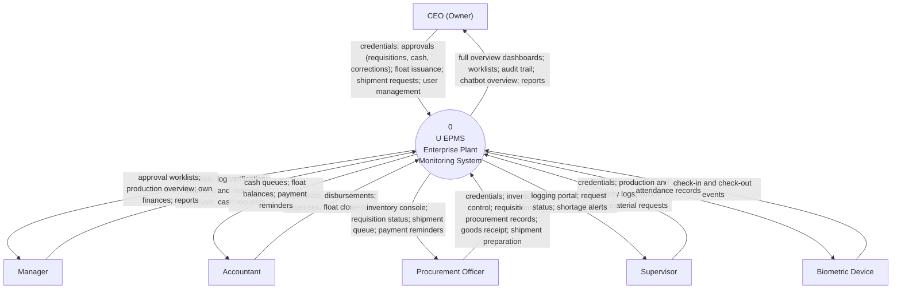
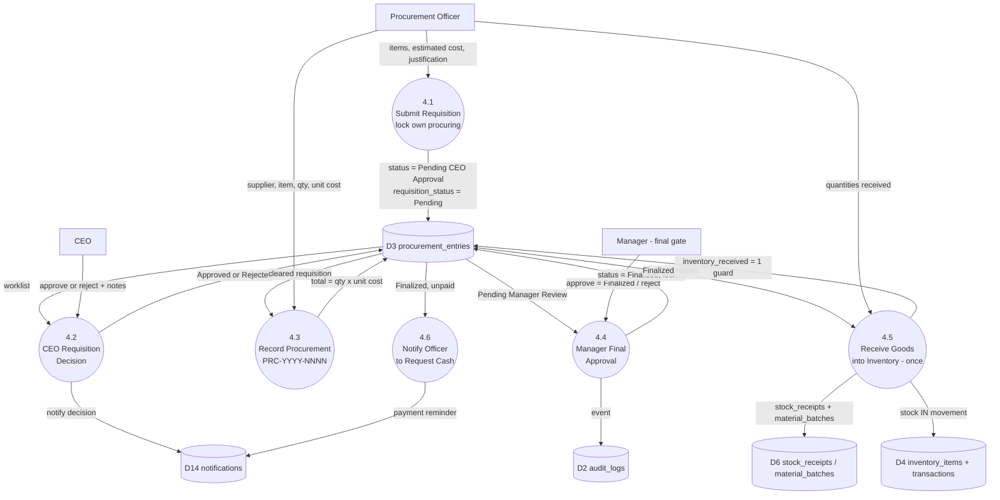
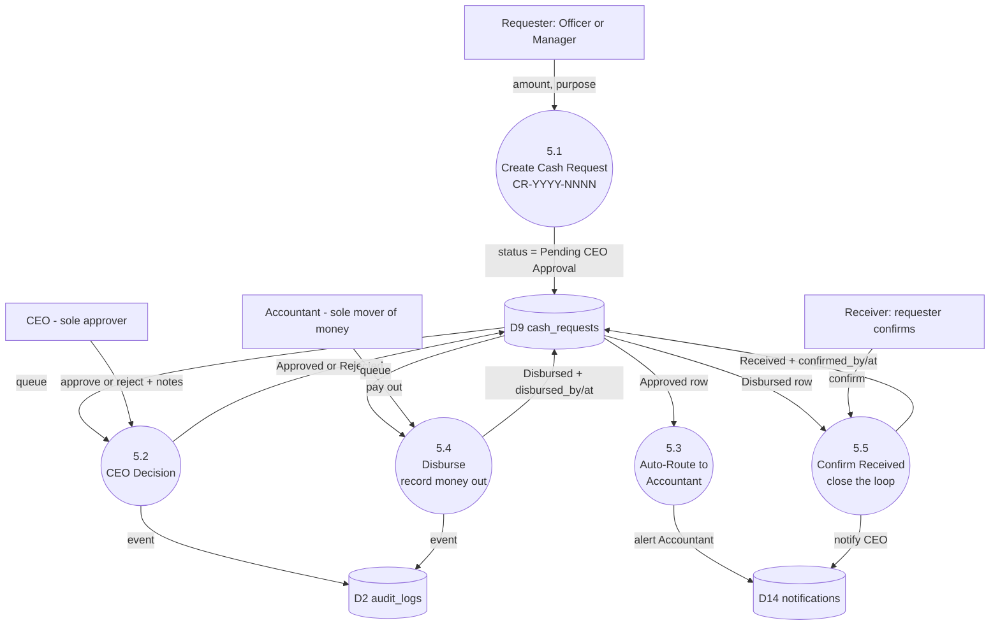
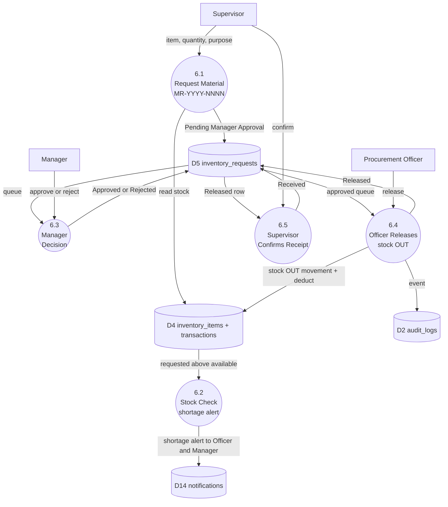
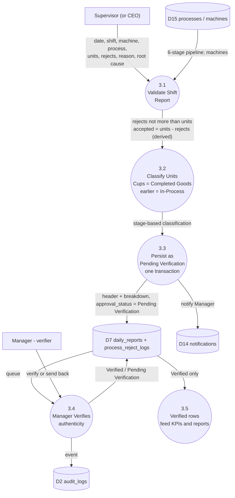
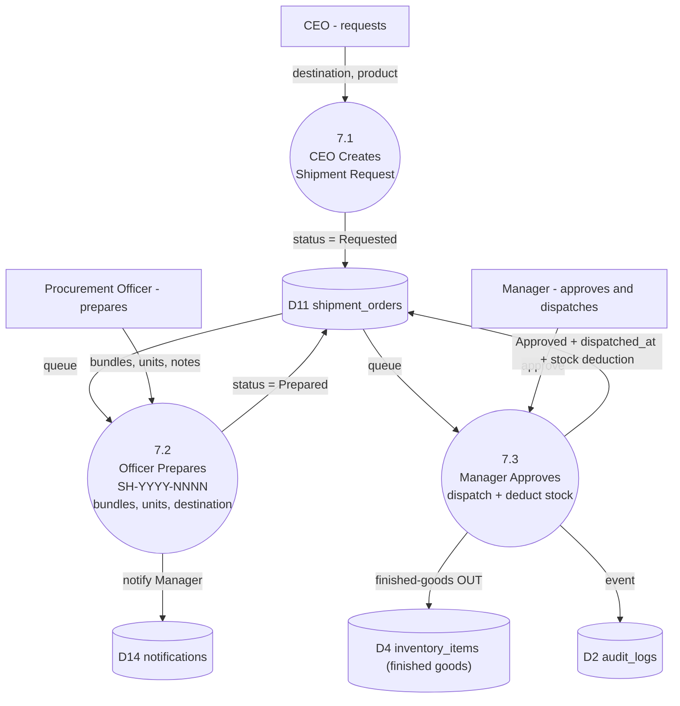
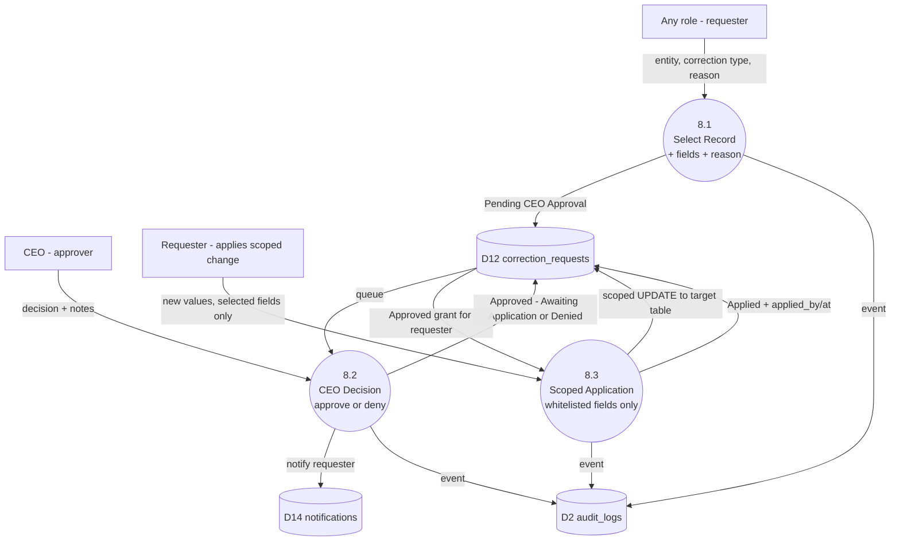
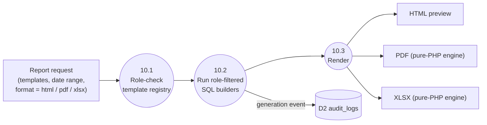
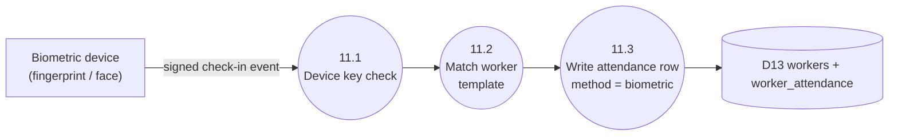

# 02 — Data Flow Diagrams (DFD)

> Levels: **Context (Level 0)** → **Level 1** (major subsystems) → **Level 2** (the multi-step chains: procurement requisition, cash request, material request, production verification, shipment, correction).
> Every process number maps to a real PHP page; every store (D#) maps to a real MySQL/SQLite table (30 tables, dual-driver).

## 1. External Entities

| Entity | What it exchanges with the system |
|---|---|
| **CEO (Owner)** | Credentials, user management, settings, requisition approvals, cash-request approvals, float issuance, shipment requests, correction approvals, audit queries, attendance views, report requests |
| **Manager** | Credentials, verification of production logs, shipment approvals, material-request approvals, cash requests and receipts, expense countersigning, targets, report requests |
| **Accountant** | Credentials, disbursements of approved cash, expenses, float close-outs, float top-up requests, report requests (cash only) |
| **Procurement Officer** | Credentials, inventory control, requisitions, procurement records, goods receipt, shipment preparation, cash requests, report requests |
| **Supervisor** | Credentials, shift production logs, electricity readings, machine-failure reports, material requests, receipt confirmations |
| **Biometric Device** | Fingerprint/face check-in events (key-authenticated endpoint) |

## 2. Level 0 — Context Diagram

## 3. Level 1 — Major Subsystems

Data stores (all live tables, MySQL `factory_db` or the SQLite equivalent):

- **D1 `users`** — accounts, roles, lockout, forced password changes
- **D2 `audit_logs`** — hash-chained, tamper-evident event trail
- **D3 `procurement_entries`** — procurement records, requisition + approval state
- **D4 `inventory_items` / `inventory_transactions`** — stock master + movement ledger
- **D5 `inventory_requests`** — Supervisor material requests
- **D6 `stock_receipts` / `stock_issues` / `material_batches`** — goods in, materials out
- **D7 `daily_reports` / `process_reject_logs`** — production headers + reject breakdown
- **D8 `electricity_readings` / `machine_failures` / `machine_downtime` / `shift_targets`** — floor data
- **D9 `cash_requests`** — the cash pipeline (request → CEO → Accountant → confirm)
- **D10 `petty_cash_issuances` / `petty_cash_expenses` / `petty_cash_requests`** — float, expenses, top-ups
- **D11 `shipment_orders` / `dispatches` / `customers`** — shipments and sales
- **D12 `correction_requests`** — supervised corrections
- **D13 `workers` / `worker_attendance`** — biometric-ready workforce records
- **D14 `notifications`** — per-user alert queue
- **D15 `processes` / `machines`** — 6-stage pipeline and machine registry
- **D16 `attachments` / `delegations` / `app_settings`** — support stores

```mermaid
graph TB
    CEO["CEO"]
    MGR["Manager"]
    ACC["Accountant"]
    PO["Procurement Officer"]
    SUP["Supervisor"]
    DEV["Biometric Device"]

    P1(("1<br/>Authentication<br/>and Sessions<br/>index.php / auth.php"))
    P2(("2<br/>Dashboards, Notifications<br/>and Chatbot<br/>dashboard.php / api_chatbot.php"))
    P3(("3<br/>Production Logging<br/>and Verification<br/>production.php / floor.php"))
    P4(("4<br/>Inventory and<br/>Procurement<br/>inventory.php / procurement.php"))
    P5(("5<br/>Cash Requests and<br/>Petty Cash<br/>cash_requests.php / petty_cash.php"))
    P6(("6<br/>Shipments and<br/>Dispatch<br/>shipments.php / dispatch.php"))
    P7(("7<br/>Correction<br/>Workflow<br/>corrections.php"))
    P8(("8<br/>Workers and<br/>Biometric Attendance<br/>workers.php / api_biometric.php"))
    P9(("9<br/>User, Settings and<br/>Audit Admin<br/>users.php / settings.php / audit_logs.php"))
    P10(("10<br/>Reporting<br/>Engine<br/>reports.php"))
    P11(("11<br/>Audit Sealer<br/>logAudit()"))

    D1[("D1 users")]
    D2[("D2 audit_logs")]
    D3[("D3 procurement_entries")]
    D4[("D4 inventory_items + transactions")]
    D5[("D5 inventory_requests")]
    D6[("D6 stock_receipts / stock_issues / material_batches")]
    D7[("D7 daily_reports + reject_logs")]
    D8[("D8 electricity / failures / downtime / targets")]
    D9[("D9 cash_requests")]
    D10[("D10 petty cash tables")]
    D11[("D11 shipments / dispatches / customers")]
    D12[("D12 correction_requests")]
    D13[("D13 workers + worker_attendance")]
    D14[("D14 notifications")]
    D15[("D15 processes / machines")]
    D16[("D16 attachments / delegations / app_settings")]

    CEO -->|"credentials"| P1
    MGR -->|"credentials"| P1
    ACC -->|"credentials"| P1
    PO -->|"credentials"| P1
    SUP -->|"credentials"| P1
    P1 -->|"role, session, flash"| CEO
    P1 --> MGR
    P1 --> ACC
    P1 --> PO
    P1 --> SUP
    P1 -->|"verify password, role, lockout"| D1

    CEO --> MGR
    CEO --> ACC
    CEO --> PO
    CEO --> SUP
    P2 -->|"role-scoped KPIs, worklists, reminders, chat answers"| CEO
    P2 --> MGR
    P2 --> ACC
    P2 --> PO
    P2 --> SUP
    P2 -->|"write alerts"| D14
    P2 -->|"read pending work across D3 D5 D7 D9 D11 D12"| D14
    P2 -.->|"CEO only: overview queries"| D1

    SUP -->|"shift log, electricity, failure report"| P3
    P3 -->|"Pending Verification rows"| D7
    P3 -->|"floor data"| D8
    P3 -->|"stage and machine lists"| D15
    MGR -->|"verify authenticity"| P3
    P3 -->|"Verified rows count in KPIs"| D7

    PO -->|"requisition; procurement record; goods receipt; item and stock control"| P4
    CEO -->|"approve requisition"| P4
    MGR -->|"final approval; material-request approval"| P4
    SUP -->|"material request; receipt confirmation"| P4
    P4 -->|"read and write"| D3
    P4 -->|"stock master and movements"| D4
    P4 -->|"requests"| D5
    P4 -->|"receipts and issues"| D6
    P4 -->|"shortage alerts"| P2

    PO -->|"cash request"| P5
    MGR -->|"cash request; confirm receipt"| P5
    CEO -->|"approve request; issue float"| P5
    ACC -->|"disburse; expenses; close-out"| P5
    P5 -->|"cash pipeline"| D9
    P5 -->|"floats, expenses, top-ups"| D10
    P5 -->|"approved-cash alerts"| P2

    CEO -->|"request shipment"| P6
    PO -->|"prepare shipment"| P6
    MGR -->|"approve and dispatch"| P6
    MGR -->|"record customer dispatch"| P6
    P6 -->|"shipment lifecycle"| D11
    P6 -->|"deduct finished stock"| D4

    MGR --> ACC
    MGR --> PO
    MGR --> SUP
    CEO -->|"request correction"| P7
    CEO -->|"approve correction"| P7
    P7 -->|"requests and grants"| D12
    P7 -->|"scoped update to target table"| D7
    P7 -.-> D3
    P7 -.-> D10

    MGR -->|"register worker; enrol biometrics"| P8
    CEO -->|"register worker; enrol biometrics; view attendance"| P8
    DEV -->|"key-authenticated check-in events"| P8
    P8 -->|"workforce records"| D13

    CEO -->|"user CRUD, settings, audit review"| P9
    P9 -->|"accounts"| D1
    P9 -->|"settings"| D16
    P9 -->|"read trail"| D2

    CEO --> MGR
    CEO --> ACC
    CEO --> PO
    CEO --> SUP
    MGR -->|"report request"| P10
    ACC -->|"report request"| P10
    PO -->|"report request"| P10
    SUP -->|"report request"| P10
    P10 -->|"HTML / PDF / XLSX"| CEO
    P10 --> MGR
    P10 --> ACC
    P10 --> PO
    P10 --> SUP
    D3 -->|"role-filtered reads"| P10
    D7 --> P10
    D10 --> P10
    D9 --> P10
    D4 --> P10
    D11 --> P10
    D1 --> P10
    D2 --> P10

    P11 -->|"append sealed rows"| D2
    P4 -->|"events"| P11
    P5 -->|"events"| P11
    P6 -->|"events"| P11
    P7 -->|"events"| P11
    P9 -->|"events"| P11
    P10 -->|"events"| P11
```

## 4. Level 2 — Procurement Requisition Chain (process 4)

**Guards (server-enforced):**
1. The Officer cannot procure while their requisition is `Pending` — the gate is checked on every procurement POST.
2. Only the CEO can decide a requisition; the Officer cannot see or use the decision endpoint.
3. The Manager's approval is **final** — there is no Accountant approval step; the Accountant only pays via Cash Requests (4.6 → process 5).
4. Goods receipt is guarded by `inventory_received` — stock can never be double-counted.

## 5. Level 2 — Cash Request Chain (process 5)

**Guards:** only the CEO approves; only the Accountant disburses (the disburse action rejects any other role); double-press protection prevents duplicate payouts; the requester's confirmation closes the loop and the CEO is told.

## 6. Level 2 — Material Request Chain (process 4, requests)

**Guards:** the Supervisor never touches stock levels — they only request and confirm. Stock is deducted exactly once, at release. A request larger than available stock fires an alert immediately, before the Manager even decides.

## 7. Level 2 — Production Verification Chain (process 3)

**Guards:** logging is Supervisor-only (the CEO may enter as owner, but every entry — CEO's included — waits for the Manager's verification). The Manager cannot log. Verified rows are the only ones counted in dashboards and reports.

## 8. Level 2 — Shipment Chain (process 6)

## 9. Level 2 — Correction Workflow (process 7)

**Guard:** the application step compares submitted fields against the recorded selection — anything outside the approved scope is rejected server-side. The old value, new value and approver all land in the sealed audit log.

## 10. Reporting and Biometric Data Flows

