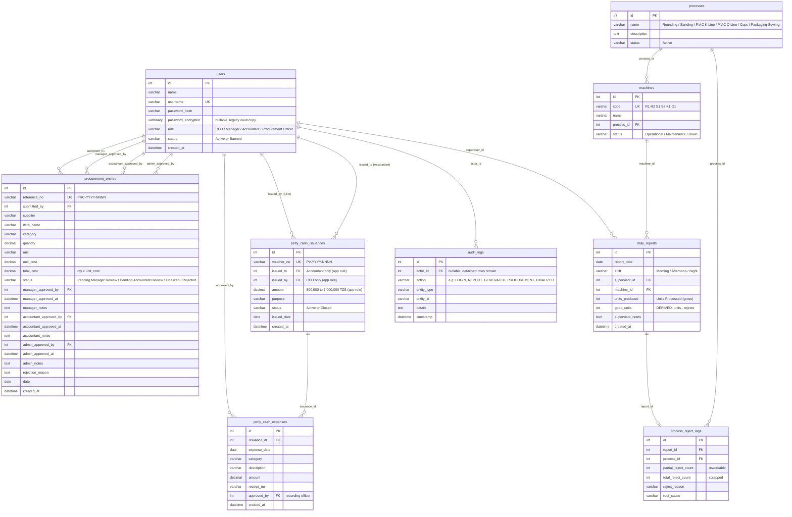
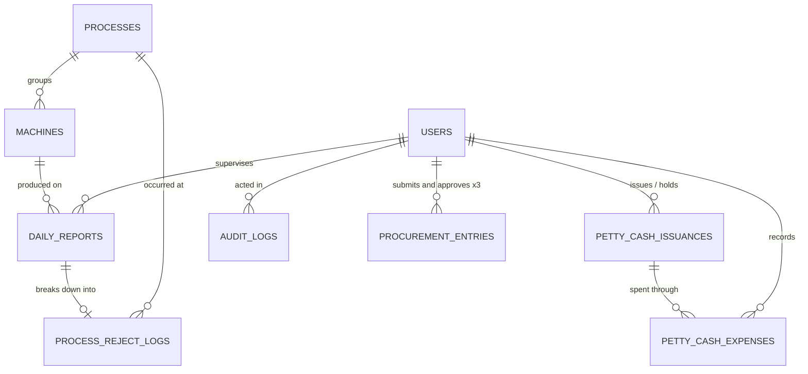

# 03 — Entity-Relationship Diagram (ERD)

> Generated from the **live** `factory_db` schema (13 foreign keys across 9 tables).
> Notation: `||` exactly one, `o|` zero-or-one, `o{` zero-or-more.

## 1. Full ERD

## 2. Relationship Narrative (every line explained)

### The `users` hub (8 outbound FK references)
`users` is the centre of the schema. Every "who did this" column in the system points at it:

| Relationship | Cardinality | Meaning |
|---|---|---|
| users → `procurement_entries.submitted_by` | 1 : 0..N | The Officer who created the record |
| users → `procurement_entries.manager_approved_by` | 1 : 0..N | Manager gate decision-maker (NULL until approved) |
| users → `procurement_entries.accountant_approved_by` | 1 : 0..N | Final gate decision-maker (NULL until finalized) |
| users → `procurement_entries.admin_approved_by` | 1 : 0..N | Reserved CEO-override column (kept for the override path) |
| users → `daily_reports.supervisor_id` | 1 : 0..N | The Manager/CEO who filed the shift report |
| users → `petty_cash_issuances.issued_by` | 1 : 0..N | CEO who disbursed the float |
| users → `petty_cash_issuances.issued_to` | 1 : 0..N | Accountant holding the float (app rule: only Accountants) |
| users → `petty_cash_expenses.approved_by` | 1 : 0..N | Officer (Accountant/Manager) who recorded the expense |
| users → `audit_logs.actor_id` | 1 : 0..N | Who performed the audited action. **Nullable + SET NULL on delete:** when a user is hard-deleted (CEO's Personnel Registry action), the audit rows survive detached — the trail stays immutable. |

> **Why four approval columns instead of one?** The two-gate workflow (Manager → Accountant) stores *who decided at which gate*, *when*, and *their notes* separately. This makes the approval chain auditable and prevents any single role from rewriting another's decision.

### The production chain (processes → machines → daily_reports → process_reject_logs)
| Relationship | Cardinality | Meaning |
|---|---|---|
| processes → machines | 1 : N | Each machine belongs to exactly one process stage (R1, R2 → Rounding; S1, S2 → Sanding; K1 → P.V.C K Line; O1 → P.V.C O Line). |
| machines → daily_reports | 1 : N | Each shift report is filed against one machine. |
| daily_reports → process_reject_logs | 1 : 0..1 | One reject breakdown per report (written in the same transaction; the JOIN in queries is `LEFT JOIN … ON l.report_id = r.id`). |
| processes → process_reject_logs | 1 : N | The stage where the rejects occurred (drives the In-Process vs Completed-Goods classification: stage 5 = Cups ⇒ Completed Goods). |

**Production business rule encoded here:** `daily_reports.units_produced` is the gross *Units Processed*; `good_units` is **derived** (`units_produced − partial_reject_count − total_reject_count`, floored at 0) and never typed by the user. Rejects can never exceed units processed (validated in `production.php` before insert).

### The petty-cash chain (issuances → expenses)
| Relationship | Cardinality | Meaning |
|---|---|---|
| petty_cash_issuances → petty_cash_expenses | 1 : N | A float voucher is disbursed once, then consumed by many expenses. Remaining balance = `amount − SUM(expenses.amount)` — computed in every listing/report, never stored, so it can never go stale. |
| users (CEO) → issuances.issued_by, users (Accountant) → issuances.issued_to | 1 : N | Two roles in one voucher, enforced by app logic (amount 800k–7M TZS; holder = active Accountant). |

### The audit spine
`audit_logs` is write-only from the application's point of view: `logAudit()` inserts (actor, action, entity_type, entity_id, details, timestamp) whenever security-relevant events happen — logins, user CRUD, float issuance, procurement decisions, report generation. Nothing ever UPDATEs or DELETEs it, and `actor_id` is `ON DELETE SET NULL` so even deleted users leave a trace.

## 3. Crow's-Foot ERD (alternative Chen-style Mermaid)

If your documentation tooling prefers classic crow's-foot diagrams (e.g. draw.io import), use this layout-optimised version:

## 4. Integrity Rules Summary

| Rule | Enforced by |
|---|---|
| Every FK has an index (`MUL`) | Schema (verified via `information_schema`) |
| Deleting a user keeps their audit rows | `audit_logs.actor_id` nullable + SET NULL |
| Orphaned reports impossible if machine/process deleted | FK constraints on `machines.process_id`, `daily_reports.machine_id`, etc. |
| One reject-log per report | App transaction + `report_id` semantics (single insert per report) |
| Unique identifiers | `users.username`, `machines.code`, `procurement_entries.reference_no`, `petty_cash_issuances.voucher_no` (all `UNI`) |
| Money precision | `DECIMAL(14,2)` on all monetary columns; quantities `DECIMAL(12,2)` |
