# 03 — Entity-Relationship Diagram (ERD)

> Generated from the **live** schema (30 tables, MySQL `factory_db` / SQLite dual-driver).
> Notation: `||` exactly one, `o|` zero-or-one, `o{` zero-or-more.

## 1. Full ERD — every relationship

```mermaid
erDiagram
    users ||--o{ procurement_entries : "submits, approves, requisitions"
    users ||--o{ daily_reports : "logs and verifies"
    users ||--o{ inventory_items : "creates"
    users ||--o{ inventory_transactions : "performs"
    users ||--o{ inventory_requests : "requests, decides, releases, receives"
    users ||--o{ cash_requests : "requests, approves, disburses, confirms"
    users ||--o{ shipment_orders : "requests, prepares, approves"
    users ||--o{ correction_requests : "requests, decides, applies"
    users ||--o{ machine_failures : "reports, verifies"
    users ||--o{ electricity_readings : "logs"
    users ||--o{ petty_cash_issuances : "issues, holds, closes, countersigns"
    users ||--o{ petty_cash_expenses : "records, confirms"
    users ||--o{ petty_cash_requests : "requests, decides"
    users ||--o{ workers : "enrols biometrics"
    users ||--o{ audit_logs : "acts (sealed chain)"
    users ||--o{ notifications : "receives"
    users ||--o{ machine_downtime : "records"
    users ||--o{ shift_targets : "sets"
    users ||--o{ stock_receipts : "receives"
    users ||--o{ stock_issues : "issues"
    users ||--o{ dispatches : "records"
    users ||--o{ delegations : "delegates to"

    processes ||--o{ machines : "groups"
    processes ||--o{ shift_targets : "targets per stage"
    machines ||--o{ daily_reports : "produced on"
    machines ||--o{ machine_failures : "fails"
    machines ||--o{ machine_downtime : "stops"
    daily_reports ||--o{ process_reject_logs : "breaks down into"

    procurement_entries ||--o{ stock_receipts : "received through"
    procurement_entries ||--o| material_batches : "creates batch"
    material_batches ||--o{ stock_issues : "issued from"
    material_batches ||--o| petty_cash_issuances : "funded by float"

    inventory_items ||--o{ inventory_transactions : "moves"
    inventory_items ||--o{ inventory_requests : "requested"
    inventory_items ||--o{ shipment_orders : "shipped as product"
    inventory_items ||--o{ stock_issues : "issued"

    petty_cash_issuances ||--o{ petty_cash_expenses : "spent through"

    customers ||--o{ dispatches : "buys"

    workers ||--o{ worker_attendance : "checks in"
```

## 2. ERD with attributes — core entities

```mermaid
erDiagram
    users {
        int id PK
        varchar name "CAPITALS validated"
        varchar username UK
        varchar password_hash "bcrypt"
        varchar role "CEO / Manager / Accountant / Procurement Officer / Supervisor"
        varchar status "Active / Banned"
        int failed_attempts "lockout counter"
        datetime locked_until "5 fails = 1 day lock"
        tinyint must_change_password "forced at first sign-in"
        datetime created_at
    }
    procurement_entries {
        int id PK
        varchar reference_no UK "PRC-YYYY-NNNN"
        int submitted_by FK
        varchar requisition_status "Pending / Approved / Rejected"
        int requisition_ceo_id FK "CEO requisition gate"
        varchar status "Pending Manager Review / Finalized / Rejected"
        int manager_approved_by FK "FINAL gate"
        tinyint inventory_received "once-only receipt guard"
        decimal total_cost "qty x unit_cost"
        date date
    }
    inventory_items {
        int id PK
        varchar item_code UK
        varchar item_name
        varchar unit
        decimal quantity
        decimal reorder_level "low-stock alert threshold"
        decimal unit_cost
        tinyint is_finished_goods "finished products vs materials"
        int created_by FK
    }
    inventory_transactions {
        int id PK
        int item_id FK
        varchar txn_type "IN / OUT / ADJUST"
        decimal quantity
        varchar reference
        int performed_by FK
        date txn_date
    }
    inventory_requests {
        int id PK
        varchar request_no UK "MR-YYYY-NNNN"
        int item_id FK
        decimal quantity
        varchar status "Pending Manager Approval / Approved / Released / Received / Rejected"
        int requested_by FK "Supervisor"
        int manager_decision_by FK
        int released_by FK "Officer deducts stock"
        int received_confirmed_by FK "Supervisor confirms"
    }
    cash_requests {
        int id PK
        varchar request_no UK "CR-YYYY-NNNN"
        int requested_by FK "Officer or Manager"
        varchar requester_role
        decimal amount
        varchar status "Pending CEO Approval / Approved / Disbursed / Received / Rejected"
        int ceo_decision_by FK
        int disbursed_by FK "Accountant only"
        int confirmed_received_by FK
    }
    shipment_orders {
        int id PK
        varchar shipment_no UK "SH-YYYY-NNNN"
        varchar destination
        int product_item_id FK "finished good"
        int bundles
        int units
        varchar status "Requested / Prepared / Approved / Rejected"
        int requested_by_ceo FK
        int prepared_by_po FK
        int approved_by_manager FK
        datetime dispatched_at
    }
    daily_reports {
        int id PK
        date report_date
        varchar shift "Morning / Afternoon / Night"
        int supervisor_id FK "logger"
        int machine_id FK
        int units_produced "gross input"
        int good_units "DERIVED units - rejects"
        varchar approval_status "Pending Verification / Verified"
        int approved_by FK "Manager verifier"
        datetime approved_at
    }
    process_reject_logs {
        int id PK
        int report_id FK
        int process_id FK
        int partial_reject_count "reworkable"
        int total_reject_count "scrapped"
        varchar reject_reason
        varchar root_cause
    }
    correction_requests {
        int id PK
        varchar entity_type "production_logs / electricity_readings / petty_cash_expenses ..."
        varchar entity_id
        varchar correction_type "Edit / Delete"
        varchar reason
        int requested_by FK
        varchar status "Pending CEO Approval / Approved - Awaiting Application / Applied / Denied"
        int decided_by FK
        int applied_by FK
    }
    workers {
        int id PK
        varchar full_name "CAPITALS validated"
        varchar staff_no UK
        varchar department
        text fingerprint_template
        text face_template
        tinyint biometric_enrolled
        int enrolled_by FK "Manager or CEO"
        varchar status "Active / Inactive"
    }
    worker_attendance {
        int id PK
        int worker_id FK
        date attend_date
        datetime check_in
        datetime check_out
        varchar method "biometric / manual"
        varchar device_info
    }
    petty_cash_issuances {
        int id PK
        varchar voucher_no UK "PV-YYYY-NNNN"
        int issued_to FK "Accountant only"
        int issued_by FK "CEO only"
        decimal amount "800,000 to 7,000,000 TZS"
        varchar status "Active / Closed"
        int closed_by FK
        int countersigned_by FK
        int batch_id FK "optional material batch link"
    }
    petty_cash_expenses {
        int id PK
        int issuance_id FK
        varchar receipt_no "duplicate guarded"
        decimal amount
        int approved_by FK "Accountant records"
        int confirmed_by FK "two-signature confirm"
    }
    audit_logs {
        int id PK
        int actor_id "nullable, detached rows survive"
        varchar action
        varchar entity_type
        varchar entity_id
        text details
        varchar prev_hash "chain link"
        varchar row_hash "tamper seal"
    }
    notifications {
        int id PK
        int user_id FK
        varchar title
        varchar body
        varchar link "open = read"
        tinyint is_read
    }
```

## 3. The remaining tables (columns at a glance)

| Table | Key columns | Purpose |
|---|---|---|
| `processes` | name (Rounding → Packaging/Sewing), status | 6-stage pipeline; Cups = completion stage |
| `machines` | code UK (R1, R2, S1, S2, K1, O1), process_id FK, status | Machine registry per stage |
| `electricity_readings` | reading_date, shift, meter_kwh, units_produced, logged_by FK | Supervisor's power log |
| `machine_failures` | machine_id FK, reported_by FK, failure_reason, status, verified_by FK | Failure report → Manager verifies |
| `machine_downtime` | machine_id FK, minutes, reason, recorded_by FK | Downtime accounting |
| `shift_targets` | process_id FK, effective_from, target_per_shift, created_by FK | Manager-set targets |
| `material_batches` | batch_code UK, procurement_id FK, quantity | Batch identity for received materials |
| `stock_receipts` | batch_id FK, procurement_id FK, quantity, received_by FK | Goods-in ledger |
| `stock_issues` | batch_id FK, quantity, issued_to_process FK, issued_by FK | Materials-out ledger |
| `petty_cash_requests` | requested_by FK, amount, status, decided_by FK | Accountant's float top-up requests |
| `customers` | name, phone, is_active | Sales counterparties |
| `dispatches` | dispatch_no, customer_id FK, bundles, units, total_amount, amount_paid | Sales dispatch ledger |
| `delegations` | from_user_id FK, to_user_id FK, role_scope, date range | Deputy coverage (single cash holder preserved) |
| `attachments` | entity_type, entity_id, stored_name, uploaded_by FK | File attachments on records |
| `app_settings` | skey UK, svalue | Key-value configuration |

## 4. Relationship narrative (the rules behind the lines)

### The `users` hub
Every "who did this" column points at `users` — over 20 foreign keys. Each workflow stores its decision-makers in **separate columns** (`requested_by` vs `ceo_decision_by` vs `disbursed_by`), so no role can rewrite another's decision and every chain is fully attributable.

### The procurement chain
`procurement_entries` carries **two independent gates**: `requisition_ceo_id` (may the Officer procure at all?) and `manager_approved_by` (is the record authentic? — **final**). The Accountant appears nowhere in the table: payment lives in `cash_requests`, by design. `inventory_received` is a once-only flag guarding goods receipt so stock cannot be double-counted.

### The inventory trio
`inventory_items` (stock master) is moved only through `inventory_transactions` (movement ledger) and `inventory_requests` (the Supervisor's road in). Receipts land via `stock_receipts` tied to `material_batches` created from procurement. Requests larger than available stock fire shortage alerts before approval.

### The production chain
`processes → machines → daily_reports → process_reject_logs` as before, now with `approval_status` on every report: rows start `Pending Verification` and only `Verified` rows feed KPIs and reports. `good_units` stays **derived** (`units − rejects`, never user-typed).

### The money chain
`cash_requests` is the only road to money for Officer and Manager: CEO approves, Accountant disburses, requester confirms — all four actors in their own columns. The float (`petty_cash_issuances`) remains single-holder (an active Accountant), bounds 800k–7M TZS, expenses two-signature confirmed, with duplicate-receipt guards.

### The audit spine (hash-chained)
`audit_logs` is write-only and **sealed**: each row stores `prev_hash` + `row_hash` over its contents, so any edit breaks the chain and the system shows a tamper banner. `actor_id` has no destructive FK — rows survive user deletion detached.

### Corrections under supervision
`correction_requests` names the target table (`entity_type`) and row (`entity_id`); approval grants the requester a scoped change (whitelisted fields only), recorded with old/new values in the sealed log.

## 5. Integrity Rules Summary

| Rule | Enforced by |
|---|---|
| One-hold cash: disburse action checks role = Accountant server-side | `cash_requests` handler |
| Goods received once per procurement record | `procurement_entries.inventory_received` flag |
| Stock never drifts: every quantity change writes a transaction row | `inventory_transactions` + app transaction |
| Rejects never exceed units processed | validated in `production.php` before insert |
| Float bounds 800,000–7,000,000 TZS; holder = active Accountant | server-checked on issuance |
| Duplicate receipts blocked | uniqueness check on `receipt_no` per float |
| 5 failed logins → 1-day lock | `users.failed_attempts` / `locked_until` |
| Unique identifiers | `users.username`, `machines.code`, `reference_no`, `request_no`, `voucher_no`, `shipment_no`, `item_code`, `staff_no` |
| Money precision | `DECIMAL(14,2)` on all monetary columns |
| Audit immutability | hash chain `prev_hash → row_hash`; no UPDATE/DELETE code path |
| Corrections scoped | field whitelist enforced on application |
