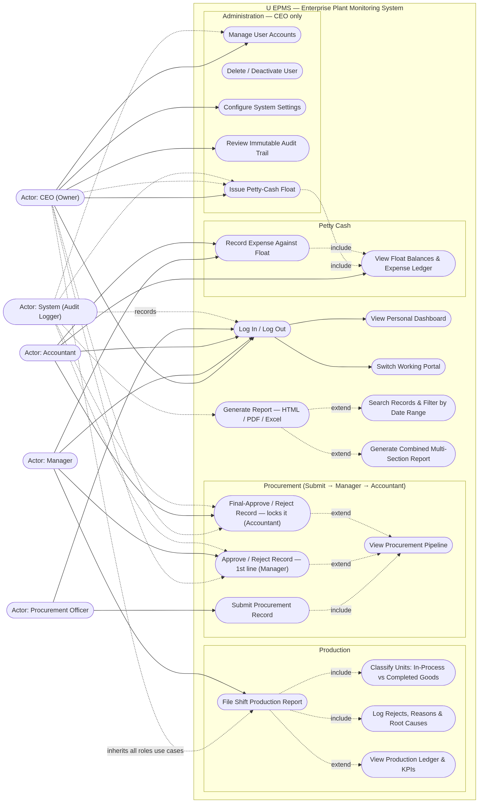
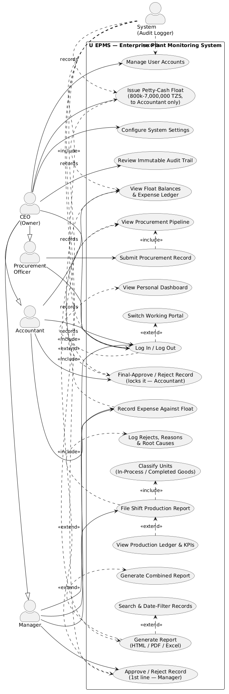
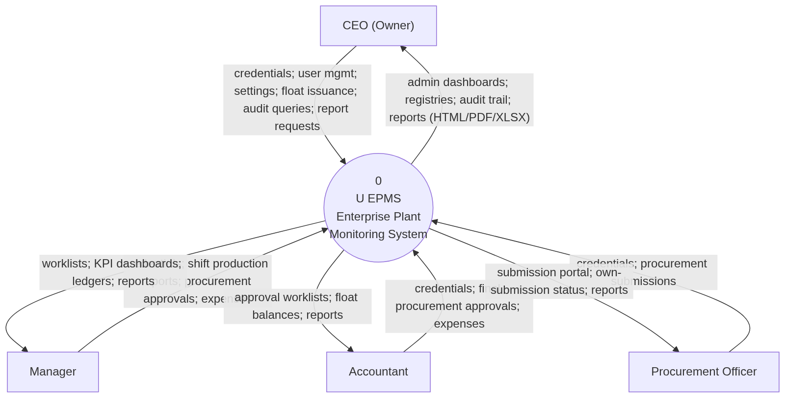
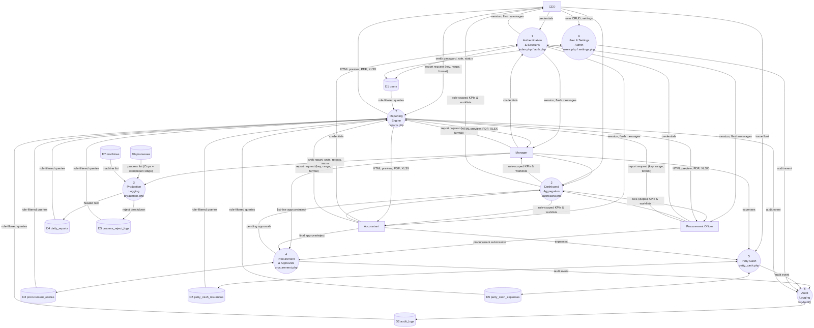
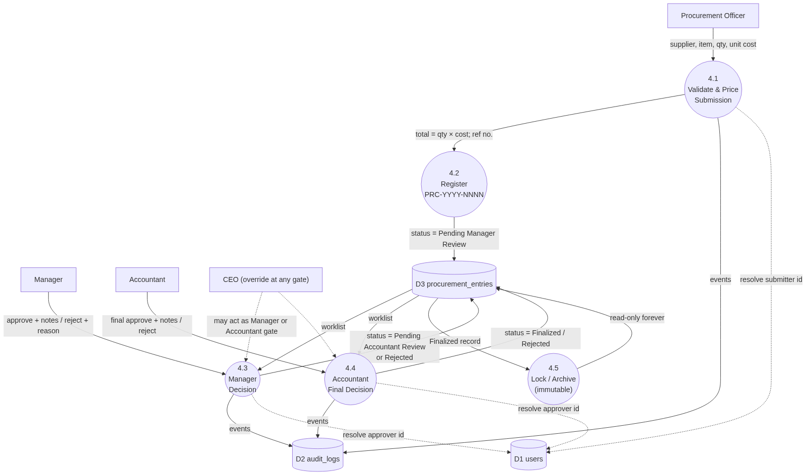
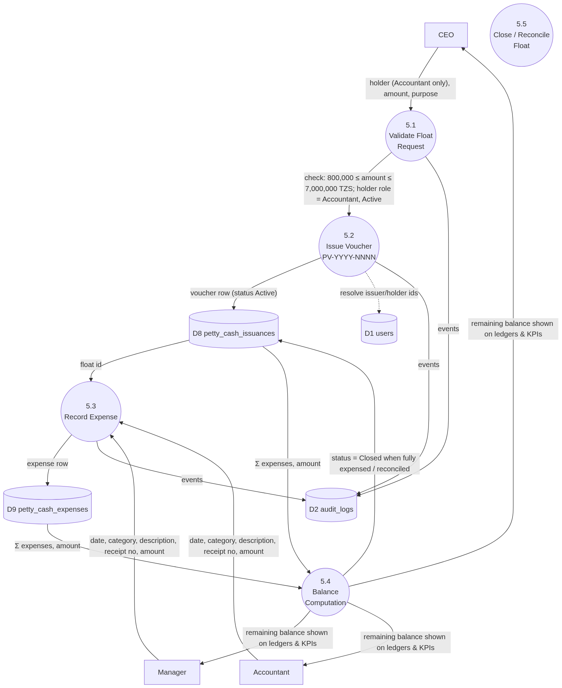
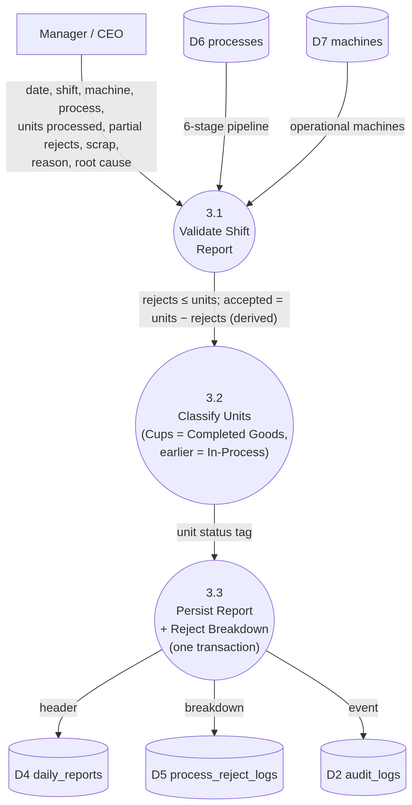
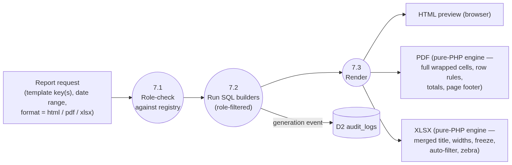
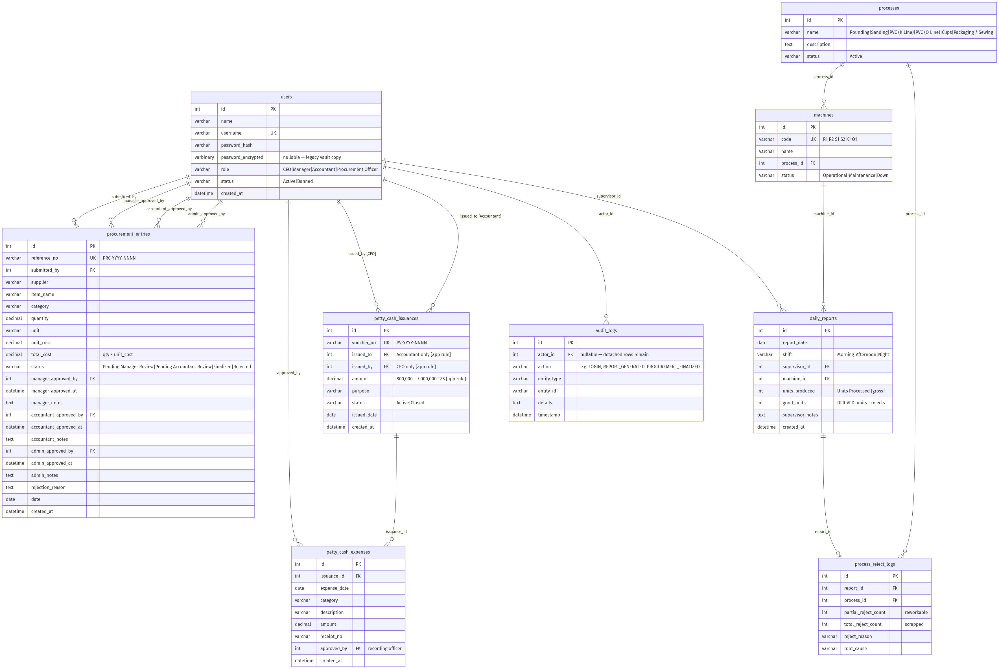
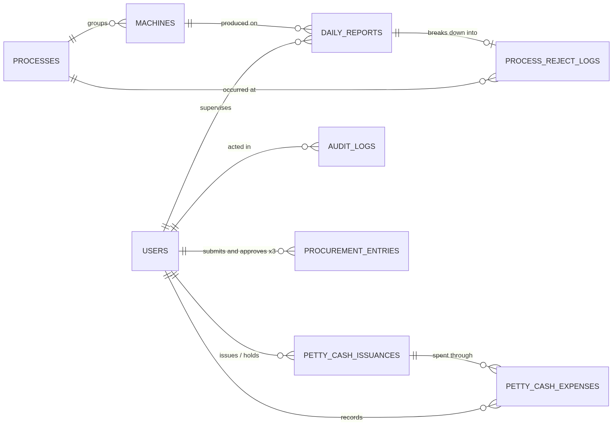

# Diagram Image Gallery

Rendered, ready-to-insert images of every system diagram — use these in **Word reports,
PowerPoint, printed submissions**, or anywhere Mermaid code won't render.

- **PNG** — insert directly into documents.
- **SVG** — infinitely scalable, ideal for print and web (opens in browsers, Word 2016+, PowerPoint).
- **Sources** in [`docs/images/src/`](images/src/) — the exact `.mmd` / `.puml` code that generated each image.
- Re-render everything after editing a source: `node scripts/render-diagrams.js`
  (the full ERD additionally uses `node scripts/make-erd-compat.js`).

## Use Case Diagram

*PlantUML variant (classic UML stick-figure layout):*

## Data Flow Diagrams

**Level 0 — Context Diagram**

**Level 1 — Major Subsystems**

**Level 2 — Procurement Approval Flow**

**Level 2 — Petty Cash Flow**

**Level 2 — Production Logging**

**Level 2 — Reporting Engine**

## Entity-Relationship Diagrams

**Full ERD (with attributes)**

**Crow's-foot overview**

## Source ↔ Image Map

| Image | Source | Defined in |
|---|---|---|
| `use-case.png/svg` | `src/use-case.mmd` | [01-use-case-diagram.md](01-use-case-diagram.md) |
| `use-case-plantuml.png/svg` | `src/use-case.puml` | [01-use-case-diagram.md](01-use-case-diagram.md) |
| `dfd-context.png/svg` | `src/dfd-context.mmd` | [02-data-flow-diagrams.md](02-data-flow-diagrams.md) |
| `dfd-l1.png/svg` | `src/dfd-l1.mmd` | [02-data-flow-diagrams.md](02-data-flow-diagrams.md) |
| `dfd-l2-procurement.png/svg` | `src/dfd-l2-procurement.mmd` | [02-data-flow-diagrams.md](02-data-flow-diagrams.md) |
| `dfd-l2-petty-cash.png/svg` | `src/dfd-l2-petty-cash.mmd` | [02-data-flow-diagrams.md](02-data-flow-diagrams.md) |
| `dfd-l2-production.png/svg` | `src/dfd-l2-production.mmd` | [02-data-flow-diagrams.md](02-data-flow-diagrams.md) |
| `dfd-l2-reports.png/svg` | `src/dfd-l2-reports.mmd` | [02-data-flow-diagrams.md](02-data-flow-diagrams.md) |
| `erd-full.png/svg` | `src/erd-full.mmd` + `erd-full-compat.mmd` | [03-entity-relationship-diagram.md](03-entity-relationship-diagram.md) |
| `erd-crow.png/svg` | `src/erd-crow.mmd` | [03-entity-relationship-diagram.md](03-entity-relationship-diagram.md) |

## Tools & Extensions Reference

| Need | Tool |
|---|---|
| Quick one-off render | [mermaid.live](https://mermaid.live) — paste code, export PNG/SVG |
| Render inside VS Code | Extensions: **Markdown Preview Mermaid Support**, **Markdown Preview Enhanced** (also exports PNG/PDF) |
| Editable shapes (rearrange by hand) | draw.io → *Arrange ▸ Insert ▸ Advanced ▸ Mermaid…* — imports the code as real, movable shapes |
| Batch render from CLI | `npx @mermaid-js/mermaid-cli -i in.mmd -o out.png` or `node scripts/render-diagrams.js` |
| PlantUML rendering | [plantuml.com/plantuml](https://www.plantuml.com/plantuml) or the VS Code PlantUML extension |
| D2 (the styled look with clusters/hexagons) | [d2lang.com](https://d2lang.com) — rewrite diagrams in D2 for that aesthetic; `npx @terrastruct/d2` renders CLI |
